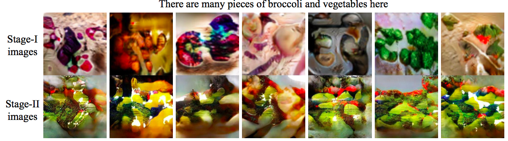
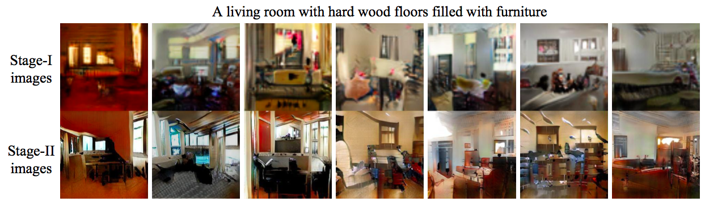

# StackGAN-pytorch
- [Tensorflow implementation](https://github.com/hanzhanggit/StackGAN)

- [Inception score evaluation](https://github.com/hanzhanggit/StackGAN-inception-model)

- [StackGAN-v2-pytorch](https://github.com/hanzhanggit/StackGAN-v2)

Pytorch implementation for reproducing COCO results in the paper [StackGAN: Text to Photo-realistic Image Synthesis with Stacked Generative Adversarial Networks](https://arxiv.org/pdf/1612.03242v2.pdf) by Han Zhang, Tao Xu, Hongsheng Li, Shaoting Zhang, Xiaogang Wang, Xiaolei Huang, Dimitris Metaxas. The network structure is slightly different from the tensorflow implementation. 


### Dependencies
python 2.7

Pytorch

In addition, please add the project folder to PYTHONPATH and `pip install` the following packages:
- `tensorboard`
- `python-dateutil`
- `easydict`
- `pandas`
- `torchfile`


**Data**

1. Download our preprocessed char-CNN-RNN text embeddings for [training coco](https://drive.google.com/open?id=0B3y_msrWZaXLQXVzOENCY2E3TlU) and  [evaluating coco](https://drive.google.com/open?id=0B3y_msrWZaXLeEs5MTg0RC1fa0U), save them to `data/coco`.
  - [Optional] Follow the instructions [reedscot/icml2016](https://github.com/reedscot/icml2016) to download the pretrained char-CNN-RNN text encoders and extract text embeddings.
2. Download the [coco](http://cocodataset.org/#download) image data. Extract them to `data/coco/`.


**Training**
- The steps to train a StackGAN model on the COCO dataset using our preprocessed embeddings.
  - Step 1: train Stage-I GAN (e.g., for 120 epochs) `python main.py --cfg cfg/coco_s1.yml --gpu 0`
  - Step 2: train Stage-II GAN (e.g., for another 120 epochs) `python main.py --cfg cfg/coco_s2.yml --gpu 1`
- `*.yml` files are example configuration files for training/evaluating our models.
- If you want to try your own datasets, [here](https://github.com/soumith/ganhacks) are some good tips about how to train GAN. Also, we encourage to try different hyper-parameters and architectures, especially for more complex datasets.


**Pretrained Model**
- [StackGAN for coco](https://drive.google.com/open?id=0B3y_msrWZaXLYjNra2ZSSmtVQlE). Download and save it to `models/coco`.
- **Our current implementation has a higher inception score(10.62±0.19) than reported in the StackGAN paper**


**Evaluating**
- Run `python main.py --cfg cfg/coco_eval.yml --gpu 2` to generate samples from captions in COCO validation set.

Examples for COCO:
 



Save your favorite pictures generated by our models since the randomness from noise z and conditioning augmentation makes them creative enough to generate objects with different poses and viewpoints from the same discription :smiley:


### Citing StackGAN
If you find StackGAN useful in your research, please consider citing:

```
@inproceedings{han2017stackgan,
Author = {Han Zhang and Tao Xu and Hongsheng Li and Shaoting Zhang and Xiaogang Wang and Xiaolei Huang and Dimitris Metaxas},
Title = {StackGAN: Text to Photo-realistic Image Synthesis with Stacked Generative Adversarial Networks},
Year = {2017},
booktitle = {{ICCV}},
}
```


**References**

- Generative Adversarial Text-to-Image Synthesis [Paper](https://arxiv.org/abs/1605.05396) [Code](https://github.com/reedscot/icml2016)
- Learning Deep Representations of Fine-grained Visual Descriptions [Paper](https://arxiv.org/abs/1605.05395) [Code](https://github.com/reedscot/cvpr2016)
